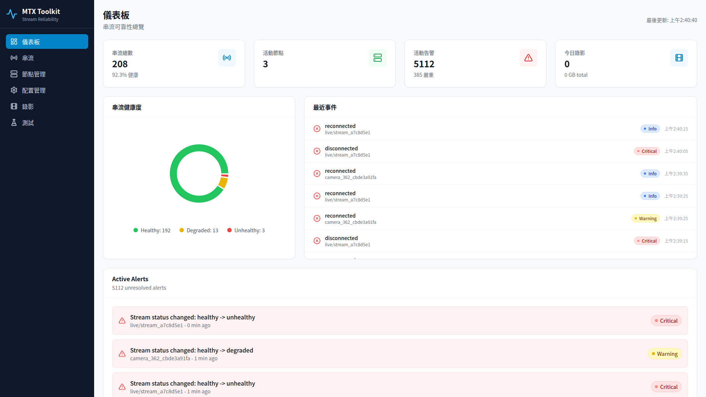
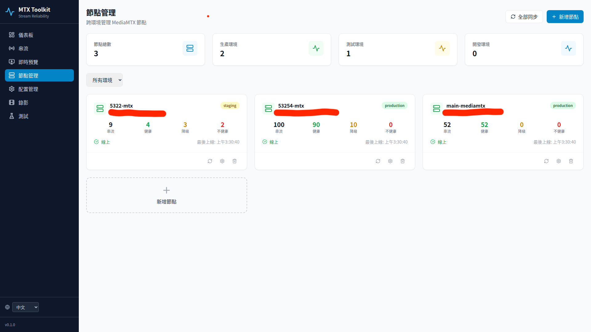
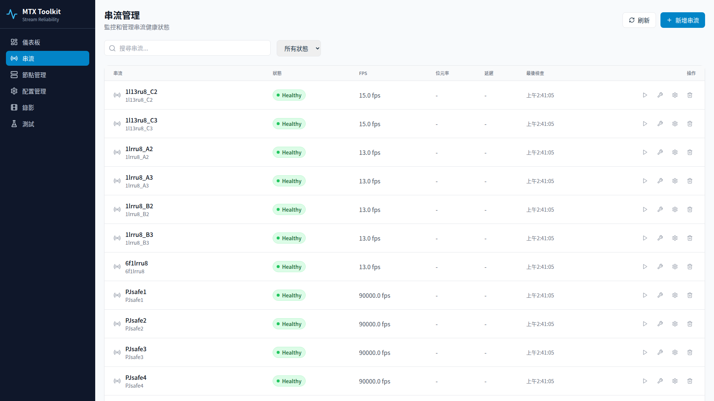
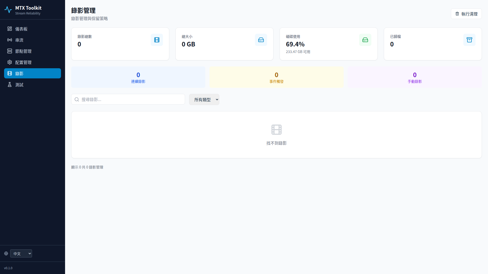

<h1 align="center">MTX Toolkit</h1>

<p align="center">
  <strong>Enterprise-grade Stream Reliability Platform for MediaMTX</strong>
</p>

<p align="center">
  <a href="README.md">English</a> | <a href="README.zh-TW.md">繁體中文</a>
</p>

<p align="center">
  <a href="#features">Features</a> •
  <a href="#screenshots">Screenshots</a> •
  <a href="#quick-start">Quick Start</a> •
  <a href="#architecture">Architecture</a> •
  <a href="#api-reference">API</a>
</p>

<p align="center">
  
  
  
  
</p>

---

## Overview

MTX Toolkit is an enterprise-grade stream reliability management platform designed for MediaMTX. It provides real-time monitoring, auto-remediation, configuration management, and multi-node fleet management. Supports monitoring **thousands of cameras** simultaneously with full health checks completed in 10 seconds.

## Features

| Feature | Description |
|---------|-------------|
| **Live Preview** | Grid view with thumbnails, hover-to-play HLS preview, click for fullscreen |
| **Dual-layer Health Check** | Quick check (API, every 10s) + Deep check (ffprobe, every 5min) |
| **Real-time Monitoring** | Supports 1000+ streams with millisecond-level status updates |
| **Auto Remediation** | Smart tiered retry with exponential backoff + jitter |
| **Fleet Management** | Unified multi-node management across environments (dev/staging/prod) |
| **Config-as-Code** | Terraform-style plan/apply workflow |
| **Recording Management** | Directory scanning, online playback, search & pagination, auto-cleanup & archiving |
| **i18n** | Traditional Chinese / English |

## Screenshots

### Dashboard
Real-time monitoring of all stream status, health distribution, active alerts, and recent events.



### Live Preview
Grid view of all streams with auto-generated thumbnails. Hover to play live HLS stream, click for fullscreen player with audio controls.


### Fleet Management
Unified multi-node management showing stream health status (Healthy/Degraded/Unhealthy) for each node.



### Streams
Complete stream CRUD operations with status filtering, FPS/bitrate monitoring, manual probe & remediation.



### Recordings
Recording file management with directory scanning, online playback (TS→MP4 transcode), search across all pages, pagination, disk usage monitoring, and auto-cleanup.



## Health Check System

### Stream Status

| Status | Color | Description |
|--------|:-----:|-------------|
| **Healthy** | 🟢 | Stream is normal and playable |
| **Degraded** | 🟡 | Connecting, on-demand standby, or temporarily unavailable |
| **Unhealthy** | 🔴 | Path doesn't exist or completely offline |
| **Unknown** | ⚪ | Not yet checked |

### Dual-layer Architecture

```
┌─────────────────────────────────────────────────────────────┐
│              Quick Check - Primary Monitoring                │
│                      (every 10 seconds)                      │
│  ┌─────────┐    ┌─────────────┐    ┌──────────────────┐    │
│  │ MediaMTX │───▶│  API Query  │───▶│ ready: true/false │    │
│  │   API    │    │ /v3/paths   │    │   Status Update   │    │
│  └─────────┘    └─────────────┘    └──────────────────┘    │
│                    ⬇ All streams in ~0.2s                   │
└─────────────────────────────────────────────────────────────┘

┌─────────────────────────────────────────────────────────────┐
│            Deep Check - Detailed Diagnostics                 │
│                      (every 5 minutes)                       │
│  ┌─────────┐    ┌─────────────┐    ┌──────────────────┐    │
│  │  RTSP   │───▶│   ffprobe   │───▶│ FPS, Resolution,  │    │
│  │ Stream  │    │  TCP Mode   │    │ Codec, Bitrate    │    │
│  └─────────┘    └─────────────┘    └──────────────────┘    │
│                    ⬇ Parallel execution                     │
└─────────────────────────────────────────────────────────────┘
```

### Monitoring Capacity

| Stream Count | Quick Check Time |
|:------------:|:----------------:|
| 200 | ~0.2s |
| 1,000 | ~1s |
| 5,000 | ~5s |

## Quick Start

### Requirements

- Docker & Docker Compose
- Running MediaMTX instance
- 2GB+ RAM

### 1. Start Services

```bash
git clone <repo-url> mtx-toolkit
cd mtx-toolkit
docker compose up -d
```

### 2. Access Interface

| Service | URL |
|---------|-----|
| **Frontend UI** | http://localhost:3001 |
| **Backend API** | http://localhost:5002 |

### 3. Add Node

Add your MediaMTX node via UI or API:

```bash
curl -X POST http://localhost:5002/api/fleet/nodes \
  -H "Content-Type: application/json" \
  -d '{
    "name": "main-mediamtx",
    "api_url": "http://your-mediamtx:9998",
    "rtsp_url": "rtsp://your-mediamtx:8554",
    "environment": "production"
  }'
```

### 4. Sync Streams

```bash
curl -X POST http://localhost:5002/api/fleet/sync-all
```

## Architecture

```
┌────────────────────────────────────────────────────────────────┐
│                         MTX Toolkit                            │
├────────────────────────────────────────────────────────────────┤
│  ┌──────────┐  ┌──────────┐  ┌──────────┐  ┌──────────┐      │
│  │ Frontend │  │ Backend  │  │  Celery  │  │  Celery  │      │
│  │  React   │  │  Flask   │  │  Worker  │  │   Beat   │      │
│  │  :3001   │  │  :5002   │  │          │  │          │      │
│  └────┬─────┘  └────┬─────┘  └────┬─────┘  └────┬─────┘      │
│       │             │             │             │             │
│       └─────────────┼─────────────┼─────────────┘             │
│                     │             │                           │
│              ┌──────┴──────┐ ┌────┴────┐                     │
│              │  PostgreSQL │ │  Redis  │                     │
│              │    :5432    │ │  :6379  │                     │
│              └─────────────┘ └─────────┘                     │
└────────────────────────────────────────────────────────────────┘
                              │
                              ▼
┌────────────────────────────────────────────────────────────────┐
│                      MediaMTX Nodes                            │
│  ┌─────────────┐  ┌─────────────┐  ┌─────────────┐           │
│  │   Node 1    │  │   Node 2    │  │   Node N    │           │
│  │ Production  │  │   Staging   │  │     Dev     │           │
│  └─────────────┘  └─────────────┘  └─────────────┘           │
└────────────────────────────────────────────────────────────────┘
```

## API Reference

### Health Check

```bash
# Quick check all nodes (milliseconds)
POST /api/health/quick-check

# Quick check single node
POST /api/health/quick-check/{node_id}

# Deep probe stream (ffprobe)
POST /api/health/streams/{stream_id}/probe
```

### Node Management

```bash
# List nodes
GET /api/fleet/nodes

# Add node
POST /api/fleet/nodes

# Sync node streams
POST /api/fleet/nodes/{node_id}/sync

# Sync all nodes
POST /api/fleet/sync-all
```

### Stream Management

```bash
# List streams
GET /api/streams

# Remediate stream
POST /api/streams/{stream_id}/remediate
```

### Recording Management

```bash
# List recordings (with search & pagination)
GET /api/recordings?search=camera1&page=1&per_page=20

# Scan local recording directory
POST /api/recordings/scan
# Request: { "node_id": 1, "force_rescan": false }

# Stream recording (with transcode for browser playback)
GET /api/recordings/{id}/stream

# Download recording
GET /api/recordings/{id}/download

# Trigger cleanup
POST /api/recordings/retention/cleanup
```

### Configuration Management

```bash
# Plan config changes
POST /api/config/plan

# Apply config
POST /api/config/apply

# Rollback config
POST /api/config/rollback/{snapshot_id}
```

## Configuration

### Environment Variables

| Variable | Default | Description |
|----------|---------|-------------|
| `MEDIAMTX_API_URL` | `http://localhost:9998` | MediaMTX API address |
| `MEDIAMTX_RTSP_URL` | `rtsp://localhost:8554` | MediaMTX RTSP address |
| `DATABASE_URL` | `postgresql://...` | PostgreSQL connection string |
| `REDIS_URL` | `redis://localhost:6379/0` | Redis connection string |

### Docker Compose

Edit `docker-compose.yml` to modify connection settings:

```yaml
environment:
  - MEDIAMTX_API_URL=http://host.docker.internal:9998
  - MEDIAMTX_RTSP_URL=rtsp://host.docker.internal:8554
```

## Service Ports

| Service | Port |
|---------|:----:|
| Frontend | 3001 |
| Backend API | 5002 |
| PostgreSQL | 15433 |
| Redis | 6380 |

## Common Commands

```bash
# Start services
docker compose up -d

# View logs
docker compose logs -f backend

# Rebuild frontend
docker compose build frontend && docker compose up -d frontend

# Rebuild backend
docker compose build backend && docker compose up -d backend celery-worker celery-beat

# Stop services
docker compose down

# Full cleanup (including database)
docker compose down -v
```

## Troubleshooting

### All Streams Show Unhealthy

Verify the node's RTSP URL is correct:

```bash
# Check node settings
curl http://localhost:5002/api/fleet/nodes | jq '.nodes[] | {name, rtsp_url}'

# Update RTSP URL
curl -X PUT http://localhost:5002/api/fleet/nodes/1 \
  -H "Content-Type: application/json" \
  -d '{"rtsp_url": "rtsp://your-mediamtx:8554"}'
```

### Health Check Timeout

Celery tasks are optimized for parallel execution. If issues persist:

```bash
# Restart Celery
docker compose restart celery-worker celery-beat
```

### Frontend Shows Old Version

```bash
# Rebuild and restart frontend
docker compose build frontend && docker compose up -d frontend

# Clear browser cache (Ctrl+Shift+R)
```

## License

MIT License
