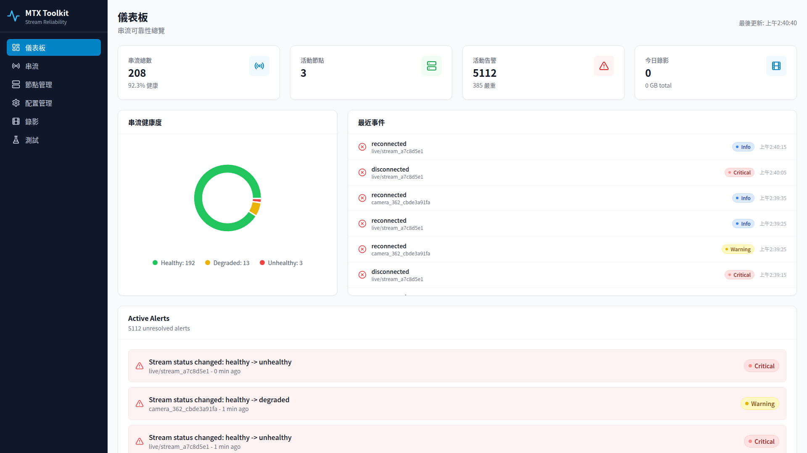
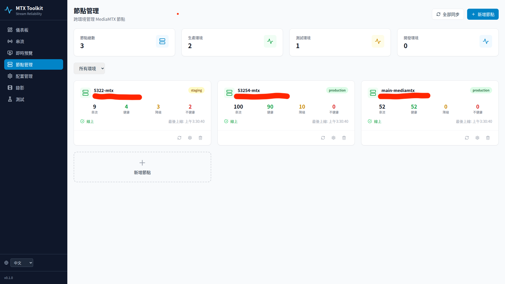
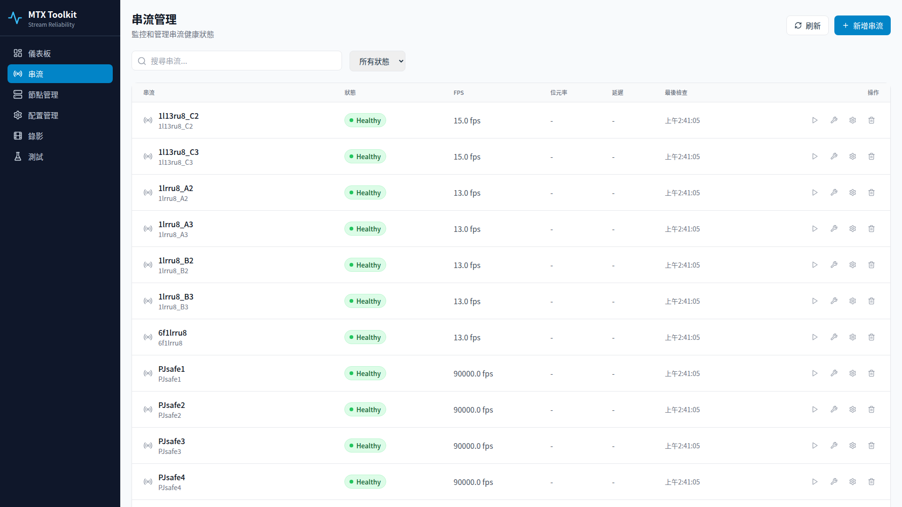
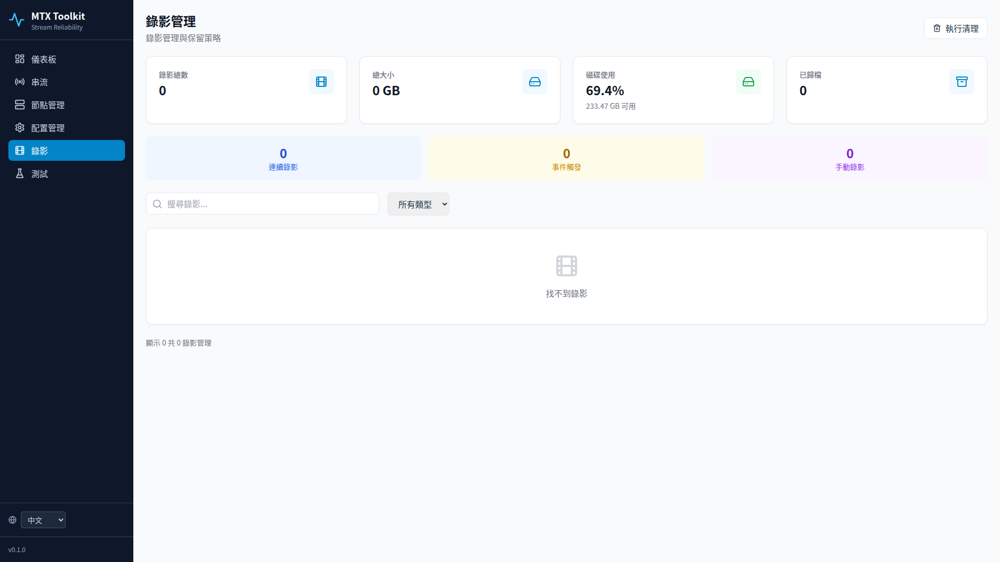

<h1 align="center">MTX Toolkit</h1>

<p align="center">
  <strong>Enterprise-grade Stream Reliability Platform for MediaMTX</strong>
</p>

<p align="center">
  <a href="README.md">English</a> | <a href="README.zh-TW.md">繁體中文</a>
</p>

<p align="center">
  <a href="#features">Features</a> •
  <a href="#screenshots">Screenshots</a> •
  <a href="#quick-start">Quick Start</a> •
  <a href="#architecture">Architecture</a> •
  <a href="#api-reference">API</a>
</p>

<p align="center">
  
  
  
  
</p>

---

## Overview

MTX Toolkit is an enterprise-grade stream reliability management platform designed for MediaMTX. Beyond real-time monitoring and multi-node fleet management, it adds a **Stream Reliability Layer** — frame-level liveness detection, protocol-aware revival, reader-preserving fallback, an HLS player watchdog, and recording-pipeline monitoring — backed by a 5-level auto-remediation engine. The whole API is protected by token authentication. Supports monitoring **thousands of cameras** simultaneously with full health checks completed in ~10 seconds.

## Features

| Feature | Description |
|---------|-------------|
| **Authentication** | Token-based login protecting every mutating/control endpoint; bootstrap admin on first run |
| **Live Preview** | Grid view with thumbnails, hover-to-play HLS preview, click for fullscreen |
| **Dual-layer Health Check** | Quick check (API, every 10s) + Deep check (ffprobe, every 5min) |
| **Frame Liveness Probe** | Detects "fake-alive" streams: frozen / black-screen / stale-PTS / silent-audio (every 30s) |
| **Auto Remediation** | 5-level tiered retry (soft-reset → protocol revival → restart sidecar/path/server) with backoff + jitter |
| **Protocol-Aware Revival** | RTSP / RTMP / WebRTC / HLS strategies, auto-detected from MediaMTX source type |
| **Reader-Preserving Fallback** | Swaps a failed source to color-bars / image / last-frame so viewers stay connected during repair |
| **HLS Player Watchdog** | Frontend stall recovery (seek nudge → level switch → full reload) with backend reporting |
| **Recording Pipeline Monitor** | Tracks write latency, segment gaps, disk IO per recording-enabled stream |
| **Real-time Monitoring** | Supports 1000+ streams with millisecond-level status updates |
| **Fleet Management** | Unified multi-node management across environments (dev/staging/prod) |
| **Viewer Management** | Real-time viewer sessions, filter by protocol/node, kick viewers |
| **IP Blacklist** | Block abusive viewer IPs (temporary or permanent, per-path / per-node scope) |
| **Config-as-Code** | Terraform-style plan/apply/rollback workflow |
| **Recording Management** | Directory scanning, online playback, search & pagination, auto-cleanup & archiving |
| **Integration Testing** | Live ffmpeg test scenarios + real integration / stress / fault-recovery suites (no mocks) |
| **Event Management** | Bulk resolve, cleanup old events, clear resolved alerts |
| **i18n** | Traditional Chinese / English (all UI text, toasts & dialogs) |

## Screenshots

### Dashboard
Real-time monitoring of all stream status, health distribution, active alerts, and recent events. Includes event management buttons to resolve all alerts, clear resolved events, or cleanup old events.



### Live Preview
Grid view of all streams with auto-generated thumbnails. Hover to play live HLS stream, click for fullscreen player with audio controls.


### Fleet Management
Unified multi-node management showing stream health status (Healthy/Degraded/Unhealthy) for each node.



### Streams
Complete stream CRUD operations with status filtering, FPS/bitrate monitoring, manual probe & remediation.



### Recordings
Recording file management with directory scanning, online playback (TS→MP4 transcode), search across all pages, pagination, disk usage monitoring, and auto-cleanup.



### Viewers
Real-time viewer session monitoring across all MediaMTX nodes. Shows client IP, protocol (RTSP/WebRTC/RTMP/SRT), connection duration, data transfer, and allows kicking viewers.


## Health Check System

### Stream Status

| Status | Color | Description |
|--------|:-----:|-------------|
| **Healthy** | 🟢 | Stream is normal and playable |
| **Degraded** | 🟡 | Connecting, on-demand standby, or temporarily unavailable |
| **Unhealthy** | 🔴 | Path doesn't exist or completely offline |
| **Unknown** | ⚪ | Not yet checked |

### Dual-layer Architecture

```
┌─────────────────────────────────────────────────────────────┐
│              Quick Check - Primary Monitoring                │
│                      (every 10 seconds)                      │
│  ┌─────────┐    ┌─────────────┐    ┌──────────────────┐    │
│  │ MediaMTX │───▶│  API Query  │───▶│ ready: true/false │    │
│  │   API    │    │ /v3/paths   │    │   Status Update   │    │
│  └─────────┘    └─────────────┘    └──────────────────┘    │
│                    ⬇ All streams in ~0.2s                   │
└─────────────────────────────────────────────────────────────┘

┌─────────────────────────────────────────────────────────────┐
│            Deep Check - Detailed Diagnostics                 │
│                      (every 5 minutes)                       │
│  ┌─────────┐    ┌─────────────┐    ┌──────────────────┐    │
│  │  RTSP   │───▶│   ffprobe   │───▶│ FPS, Resolution,  │    │
│  │ Stream  │    │  TCP Mode   │    │ Codec, Bitrate    │    │
│  └─────────┘    └─────────────┘    └──────────────────┘    │
│                    ⬇ Parallel execution                     │
└─────────────────────────────────────────────────────────────┘
```

### Monitoring Capacity

| Stream Count | Quick Check Time |
|:------------:|:----------------:|
| 200 | ~0.2s |
| 1,000 | ~1s |
| 5,000 | ~5s |

## Stream Reliability Layer

A stream can be "connected" yet broken — frozen, black, or silent. The reliability layer catches these and recovers automatically.

### Liveness Classification

| Class | Meaning |
|-------|---------|
| `live` | Frames advancing, picture & audio OK |
| `frozen` | Same frame hash repeating |
| `black_screen` | Brightness below threshold |
| `stale` | Presentation timestamp (PTS) not advancing |
| `silent` | Audio RMS below threshold |
| `unknown` | Not yet probed |

### 5-Level Auto-Remediation

Liveness triggers start at level 0; health-check triggers start at level 1. Each level retries with exponential backoff + jitter before escalating.

```
0  SOFT_RESET          → re-pull the source / nudge the path
1  PROTOCOL_REVIVAL    → protocol-specific revive (RTSP/RTMP/WebRTC/HLS)
2  RESTART_SIDECAR     → restart the publisher sidecar
3  RESTART_PATH        → recreate the MediaMTX path
4  RESTART_MEDIAMTX    → restart the MediaMTX container (last resort)
```

During remediation, **reader-preserving fallback** can swap the path source to color-bars / a custom image / the last good frame, so connected viewers don't drop while the source is being fixed. A built-in **circuit breaker** (cooldown + recent-failure count) prevents remediation storms.

## Authentication & Security

The entire API requires a bearer token, except the public allowlist (login, container health check, and the browser playback-report telemetry endpoint).

- **First run** creates a bootstrap admin from `BOOTSTRAP_ADMIN_USERNAME` / `BOOTSTRAP_ADMIN_PASSWORD` (default `admin` / `admin`). **Change it immediately.**
- Tokens are signed (HMAC, time-limited). Set a strong `SECRET_KEY` — in production/staging the app **refuses to start** on the built-in dev default, and Docker Compose **fails fast** if `SECRET_KEY` is unset.
- CORS is an explicit allowlist via `CORS_ORIGINS` (no wildcard).
- Credentials embedded in stream URLs (`rtsp://user:pass@…`) are redacted from logs.

```bash
# Log in and capture a token
TOKEN=$(curl -s -X POST http://localhost:5002/api/auth/login \
  -H "Content-Type: application/json" \
  -d '{"username":"admin","password":"admin"}' | jq -r .token)

# Use it on any protected endpoint
curl http://localhost:5002/api/streams/ -H "Authorization: Bearer $TOKEN"

# Change the admin password
curl -X POST http://localhost:5002/api/auth/change-password \
  -H "Authorization: Bearer $TOKEN" -H "Content-Type: application/json" \
  -d '{"current_password":"admin","new_password":"a-strong-new-password"}'
```

## Quick Start

### Requirements

- Docker & Docker Compose
- Running MediaMTX instance
- 2GB+ RAM

### 1. Configure Secrets

Docker Compose requires `SECRET_KEY` to be set (otherwise tokens would be forgeable). Copy the example and set strong values:

```bash
git clone <repo-url> mtx-toolkit
cd mtx-toolkit
cp .env.example .env
# Generate a strong key:
echo "SECRET_KEY=$(python3 -c 'import secrets;print(secrets.token_urlsafe(48))')" >> .env
# Optionally set BOOTSTRAP_ADMIN_PASSWORD, CORS_ORIGINS, etc. in .env
```

### 2. Start Services

```bash
docker compose up -d
```

### 3. Log In

Open http://localhost:3001 and sign in with the bootstrap admin (default `admin` / `admin`, or whatever you set in `.env`). Change the password from the UI / API immediately.

### 4. Access Interface

| Service | URL |
|---------|-----|
| **Frontend UI** | http://localhost:3001 |
| **Backend API** | http://localhost:5002 |

### 5. Add Node

Add your MediaMTX node via UI or API:

```bash
curl -X POST http://localhost:5002/api/fleet/nodes \
  -H "Content-Type: application/json" \
  -d '{
    "name": "main-mediamtx",
    "api_url": "http://your-mediamtx:9998",
    "rtsp_url": "rtsp://your-mediamtx:8554",
    "environment": "production"
  }'
```

### 6. Sync Streams

```bash
curl -X POST http://localhost:5002/api/fleet/sync-all
```

> All `curl` examples below omit the `Authorization: Bearer $TOKEN` header for brevity — it is required on every endpoint except the public allowlist.

## Architecture

```
┌────────────────────────────────────────────────────────────────┐
│                         MTX Toolkit                            │
├────────────────────────────────────────────────────────────────┤
│  ┌──────────┐  ┌──────────┐  ┌──────────┐  ┌──────────┐      │
│  │ Frontend │  │ Backend  │  │  Celery  │  │  Celery  │      │
│  │  React   │  │  Flask   │  │  Worker  │  │   Beat   │      │
│  │  :3001   │  │  :5002   │  │          │  │          │      │
│  └────┬─────┘  └────┬─────┘  └────┬─────┘  └────┬─────┘      │
│       │             │             │             │             │
│       └─────────────┼─────────────┼─────────────┘             │
│                     │             │                           │
│              ┌──────┴──────┐ ┌────┴────┐                     │
│              │  PostgreSQL │ │  Redis  │                     │
│              │    :5432    │ │  :6379  │                     │
│              └─────────────┘ └─────────┘                     │
└────────────────────────────────────────────────────────────────┘
                              │
                              ▼
┌────────────────────────────────────────────────────────────────┐
│                      MediaMTX Nodes                            │
│  ┌─────────────┐  ┌─────────────┐  ┌─────────────┐           │
│  │   Node 1    │  │   Node 2    │  │   Node N    │           │
│  │ Production  │  │   Staging   │  │     Dev     │           │
│  └─────────────┘  └─────────────┘  └─────────────┘           │
└────────────────────────────────────────────────────────────────┘
```

## API Reference

> Every endpoint except the public allowlist (`/api/auth/login`, `/api/health/`, `/api/health/playback-report`) requires `Authorization: Bearer <token>`.

### Authentication

```bash
# Log in -> { token, user }
POST /api/auth/login        # { "username": "...", "password": "..." }

# Current user
GET  /api/auth/me

# Change password
POST /api/auth/change-password   # { "current_password": "...", "new_password": "..." }

# Logout (client discards token)
POST /api/auth/logout
```

### Health Check

```bash
# Quick check all nodes (milliseconds)
POST /api/health/quick-check

# Quick check single node
POST /api/health/quick-check/{node_id}

# Deep probe stream (ffprobe)
POST /api/health/streams/{stream_id}/probe
```

### Node Management

```bash
# List nodes
GET /api/fleet/nodes

# Add node
POST /api/fleet/nodes

# Sync node streams
POST /api/fleet/nodes/{node_id}/sync

# Sync all nodes
POST /api/fleet/sync-all
```

### Stream Management

```bash
# List streams
GET /api/streams

# Remediate stream (5-level tiered retry)
POST /api/streams/{stream_id}/remediate

# Protocol-aware revival (level 0/1)
POST /api/streams/{stream_id}/soft-reset
POST /api/streams/{stream_id}/revive
```

### Stream Reliability

```bash
# Liveness — list / probe / history
GET  /api/liveness/streams?classification=frozen
POST /api/liveness/streams/{stream_id}/probe
GET  /api/liveness/history/{stream_id}

# Reader-preserving fallback
PUT  /api/fallback/streams/{stream_id}        # { "fallback_type": "color_bars" }
POST /api/fallback/streams/{stream_id}/activate
POST /api/fallback/streams/{stream_id}/deactivate

# Recording pipeline monitoring
GET  /api/pipeline/status
GET  /api/pipeline/gaps
POST /api/pipeline/streams/{stream_id}/check

# Client playback telemetry (public — sent by the HLS watchdog)
POST /api/health/playback-report
```

### IP Blacklist

```bash
GET    /api/blacklist            # list blocked IPs
POST   /api/blacklist            # { "ip_address": "1.2.3.4", "reason": "...", "duration": "1h" }
DELETE /api/blacklist/{id}       # unblock
```

### Integration Testing

```bash
# Live ffmpeg test scenarios (server-owned, no shell injection)
GET  /api/testing/scenarios
POST /api/testing/scenarios/{id}/start    # testsrc | black | silence | lowfps
POST /api/testing/scenarios/{id}/stop

# Real test suites (no simulated results)
POST /api/testing/suite/integration       # probe every stream, aggregate pass/fail
POST /api/testing/suite/stress            # { "url": "...", "concurrency": 5 }
POST /api/testing/suite/recovery          # soft-reset a stream, verify it recovers
```

### Recording Management

```bash
# List recordings (with search & pagination)
GET /api/recordings?search=camera1&page=1&per_page=20

# Scan local recording directory
POST /api/recordings/scan
# Request: { "node_id": 1, "force_rescan": false }

# Stream recording (with transcode for browser playback)
GET /api/recordings/{id}/stream

# Download recording
GET /api/recordings/{id}/download

# Trigger cleanup
POST /api/recordings/retention/cleanup
```

### Event Management

```bash
# Resolve all unresolved events
POST /api/dashboard/events/resolve-all

# Clear all resolved events
POST /api/dashboard/events/clear-resolved

# Cleanup old events (default: 7 days)
POST /api/dashboard/events/cleanup
# Request: { "days": 7, "resolved_only": false }
```

### Viewer Management

```bash
# List all viewer sessions (with filters & pagination)
GET /api/sessions?node_id=1&protocol=rtsp&page=1&per_page=50

# Get viewer summary statistics
GET /api/sessions/summary

# Get viewers by node
GET /api/sessions/node/{node_id}

# Get viewers by stream path
GET /api/sessions/path/{stream_path}

# Kick a viewer session
POST /api/sessions/kick
# Request: { "node_id": 1, "session_id": "uuid", "protocol": "rtsp" }
```

### Configuration Management

```bash
# Plan config changes
POST /api/config/plan

# Apply config
POST /api/config/apply

# Rollback config
POST /api/config/rollback/{snapshot_id}
```

## Configuration

### Environment Variables

| Variable | Default | Description |
|----------|---------|-------------|
| `SECRET_KEY` | *(dev default)* | Token signing key. **Required** in prod/staging & Docker Compose; app/compose refuse to start otherwise |
| `JWT_SECRET_KEY` | falls back to `SECRET_KEY` | Optional separate key for auth tokens |
| `JWT_ACCESS_TOKEN_EXPIRES_HOURS` | `12` | Token lifetime |
| `AUTH_ENABLED` | `true` | Enforce auth on protected endpoints (disabled under tests) |
| `BOOTSTRAP_ADMIN_USERNAME` | `admin` | Initial admin username (created on first run) |
| `BOOTSTRAP_ADMIN_PASSWORD` | `admin` | Initial admin password — **change immediately** |
| `CORS_ORIGINS` | `localhost:3000,3001` | Comma-separated allowlist. **Required** in prod/staging (no wildcard) |
| `LOG_LEVEL` | `INFO` | Log level (structlog) |
| `LOG_JSON` | `true` (prod) / `false` (dev) | JSON vs human-readable logs |
| `MEDIAMTX_API_URL` | `http://localhost:9998` | MediaMTX API address |
| `MEDIAMTX_RTSP_URL` | `rtsp://localhost:8554` | MediaMTX RTSP address |
| `DATABASE_URL` | `postgresql://...` | PostgreSQL connection string |
| `REDIS_URL` | `redis://localhost:6379/0` | Redis connection string |

### Docker Compose

Edit `docker-compose.yml` to modify connection settings:

```yaml
environment:
  - MEDIAMTX_API_URL=http://host.docker.internal:9998
  - MEDIAMTX_RTSP_URL=rtsp://host.docker.internal:8554
```

## Service Ports

| Service | Port |
|---------|:----:|
| Frontend | 3001 |
| Backend API | 5002 |
| PostgreSQL | 15433 |
| Redis | 6380 |

## Common Commands

```bash
# Start services
docker compose up -d

# View logs
docker compose logs -f backend

# Rebuild frontend
docker compose build frontend && docker compose up -d frontend

# Rebuild backend
docker compose build backend && docker compose up -d backend celery-worker celery-beat

# Stop services
docker compose down

# Full cleanup (including database)
docker compose down -v
```

## Troubleshooting

### All Streams Show Unhealthy

Verify the node's RTSP URL is correct:

```bash
# Check node settings
curl http://localhost:5002/api/fleet/nodes | jq '.nodes[] | {name, rtsp_url}'

# Update RTSP URL
curl -X PUT http://localhost:5002/api/fleet/nodes/1 \
  -H "Content-Type: application/json" \
  -d '{"rtsp_url": "rtsp://your-mediamtx:8554"}'
```

### Health Check Timeout

Celery tasks are optimized for parallel execution. If issues persist:

```bash
# Restart Celery
docker compose restart celery-worker celery-beat
```

### Frontend Shows Old Version

```bash
# Rebuild and restart frontend
docker compose build frontend && docker compose up -d frontend

# Clear browser cache (Ctrl+Shift+R)
```

### `SECRET_KEY is required` on `docker compose up`

Compose refuses to start without a signing key (otherwise tokens are forgeable). Create `.env` with a strong `SECRET_KEY` (see [Quick Start](#1-configure-secrets)).

### Forgot the admin password

Reset it directly in the database:

```bash
docker compose exec backend python3 -c "from app import create_app,db; from app.models import User; \
app=create_app(); ctx=app.app_context(); ctx.push(); \
u=User.query.filter_by(username='admin').first(); u.set_password('new-password'); db.session.commit(); print('reset')"
```

## Upgrading an Existing Deployment

New tables (`users`, reliability-layer tables) are created automatically by `db.create_all()`. For new **columns** on existing tables, apply the SQL scripts in `backend/migrations/` (e.g. `add_users_table.sql`, `add_reliability_layer_columns.sql`):

```bash
docker compose exec postgres psql -U mtx -d mtx_toolkit -f /path/to/migration.sql
```

## License

MIT License
